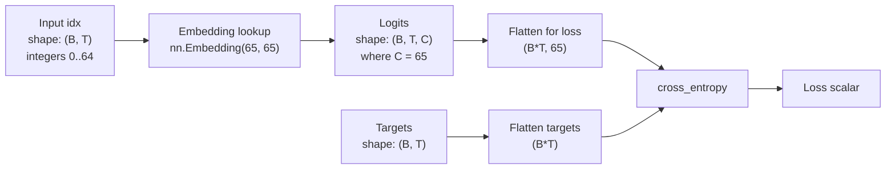

# Current `gpt.py` Architecture

This is the model currently defined in `gpt/gpt.py`.

## Big Picture

The entire neural network is just **one embedding table**:

```python
self.token_embedding_table = nn.Embedding(vocab_size, vocab_size)
```

With your current dataset:

- `vocab_size = 65`
- parameter shape = `(65, 65)`
- total trainable parameters = `65 * 65 = 4,225`

So yes, this model really can train. It is just a **very tiny model**.

## Visual



## What The Parameters Are

The learnable parameter is a single matrix:

```text
token_embedding_table.weight
shape: (vocab_size, vocab_size) = (65, 65)
```

You can picture it like this:

```text
row 0  -> logits to predict next char when current char is token 0
row 1  -> logits to predict next char when current char is token 1
row 2  -> logits to predict next char when current char is token 2
...
row 64 -> logits to predict next char when current char is token 64
```

Each row is a vector of length `65`, one score per possible next character.

So when the model sees a token id like `17`, it simply grabs row `17` from the table and uses that row as the logits for the next character prediction.

## Why This Counts As A Model

Even though there is no attention, no MLP, and no positional embedding yet, this still learns because gradient descent updates the embedding table weights to make correct next-character predictions more likely.

In other words:

1. Input token id goes in.
2. Model looks up a row of trainable numbers.
3. Those numbers are treated as logits for the next token.
4. `cross_entropy` compares those logits against the true next token.
5. Backprop updates the table.

## What It Can And Cannot Learn

This model is basically a **bigram lookup table**.

That means it can learn:

- "after `q`, `u` is likely"
- "after space, capital letters sometimes happen"
- "after `t`, maybe `h` is common"

That also means it cannot really use longer context well, because each prediction is based only on the current token's row in the table.

Even though your input shape is `(B, T)`, there is no interaction across time steps inside the model yet. Each position is processed independently.

## One-Step Example

If a batch contains:

```text
idx = [[18, 46, 10]]
```

then the model does:

```text
row 18 -> logits for next token after token 18
row 46 -> logits for next token after token 46
row 10 -> logits for next token after token 10
```

This produces:

```text
logits shape = (1, 3, 65)
```

Then training compares those 3 predictions to the 3 target next-token ids.

## Why `generate()` Works

During generation:

1. `self(idx)` produces logits for every position in the current sequence.
2. `logits[:, -1, :]` keeps only the last position's logits.
3. `softmax` turns logits into probabilities.
4. `torch.multinomial` samples the next token.
5. That token gets appended and the loop repeats.

So generation is repeatedly using the learned lookup table to sample one next character at a time.

## Mental Model

The current network is not really "thinking" over the whole sequence yet.

It is closer to:

```text
current character -> look up a trainable row -> predict next character
```

That is why the parameter count is so small, and also why this is a good first step before adding positional embeddings, self-attention, and transformer blocks.
